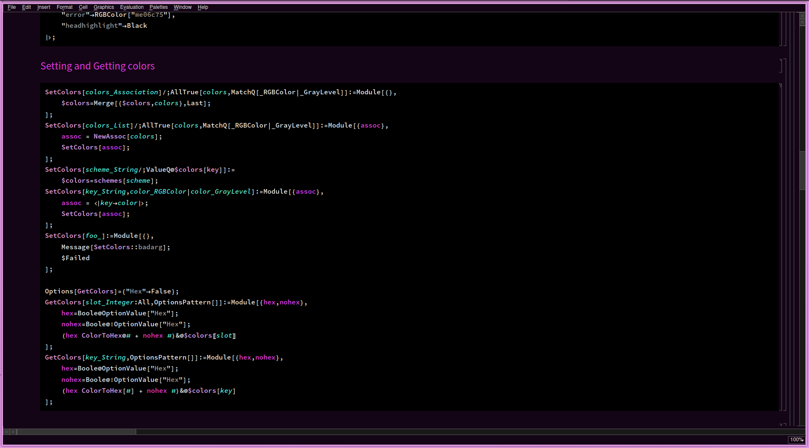
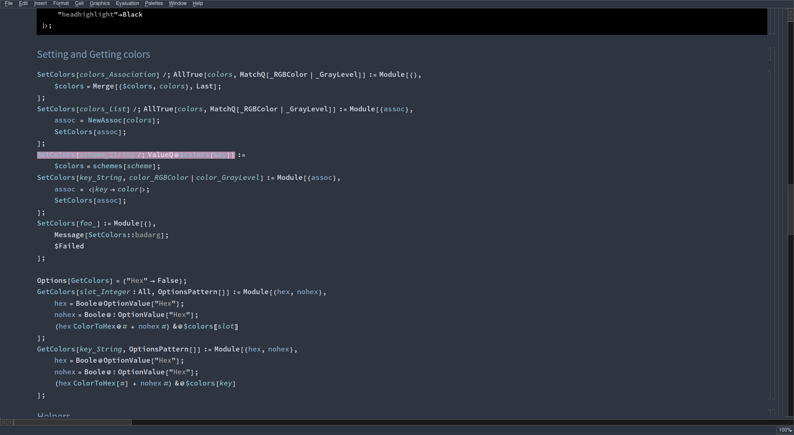
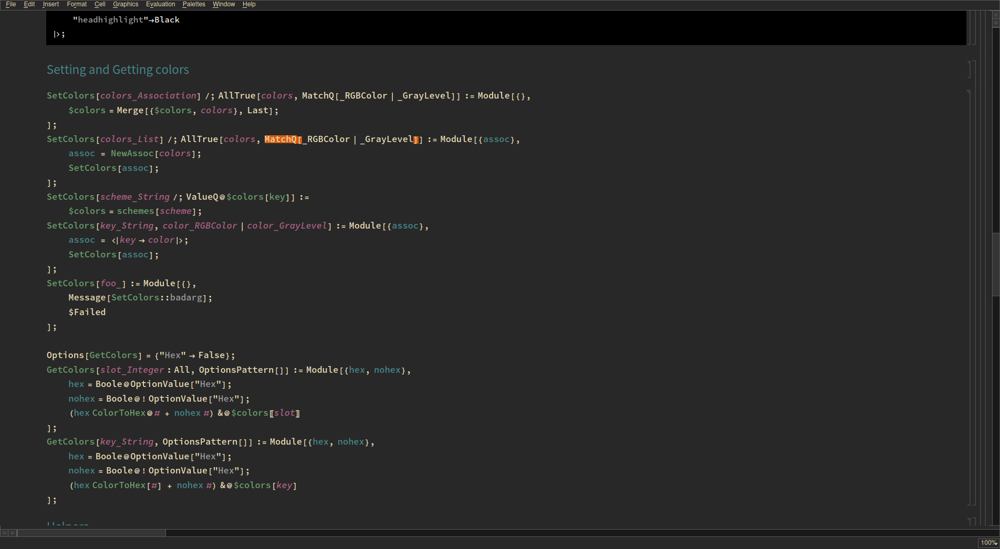
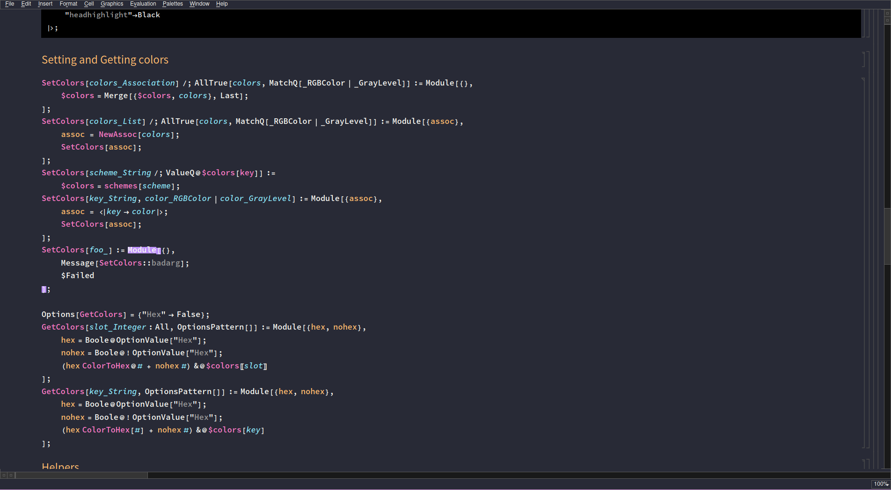

# maTHEMEatica

Are you tired of Mathematica's default look. Do you want to use it in a dark mode or have it obey your personal color scheme? maTHEMEatica allows you all of this in a very simple and userfriendly way. 

## Usage 

Simply create a symbolic link to maTHEMEatica.wl in $UserBaseDirectory/Applications or directly put the file there. Open up example.nb and follow the steps. E.g., 

```
# git clone https://gitlab.com/jakobneef/mathemeatica
$ cd mathemematica
$ ln -s $(pwd) ~/.Mathematica/Applications/maTHEMEmatica
$ mathematica example.nb
```
## Screenshots






